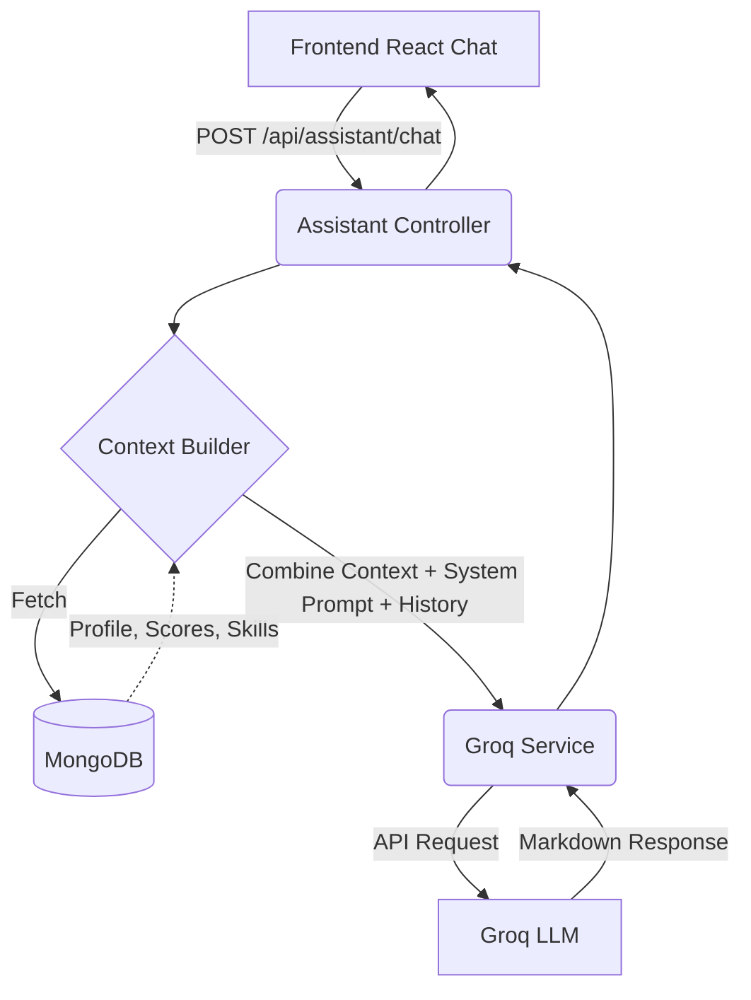

# PlacementOS AI Placement Assistant

The PlacementOS AI Assistant is a real-time, context-aware LLM application powered by **Groq** that provides dynamic placement guidance, interview preparation, and opportunity insights based on a student's actual database profile.

## Architecture

The system strictly isolates deterministic calculations (like eligibility checking and match scoring) from AI explanations to prevent hallucination. The LLM only receives read-only context to inform its conversational responses.



## Security & Privacy
- **No Browser Exposure**: The `GROQ_API_KEY` lives exclusively in the Node.js backend. It is never exposed in the browser network tab or bundled in frontend assets.
- **Strict Context Boundary**: The AI is fed only the necessary data about the requesting student.
- **Rate Limiting**: The chat endpoint is protected by `express-rate-limit` (10 requests per minute) to prevent abuse and excessive API costs.
- **Graceful Fallback**: If the `GROQ_API_KEY` is not present, the system defaults to a safe fallback mode. The app will not crash, but users will be informed that AI generation is inactive.

## Deterministic vs. AI Logic
The AI is instructed via its **System Prompt** never to calculate eligibility or override match scores. 
For example:
1. The backend `matchingService` deterministically calculates that a student is a 93% match for a role.
2. This calculation is sent in the context payload to Groq.
3. Groq explains to the user *why* they received a 93% score using natural language, but does not invent the score itself.

## Environment Variables
To enable the AI features, add the following to `backend/.env`:
```
GROQ_API_KEY=your_key_here
GROQ_MODEL=llama-3.1-8b-instant
```
