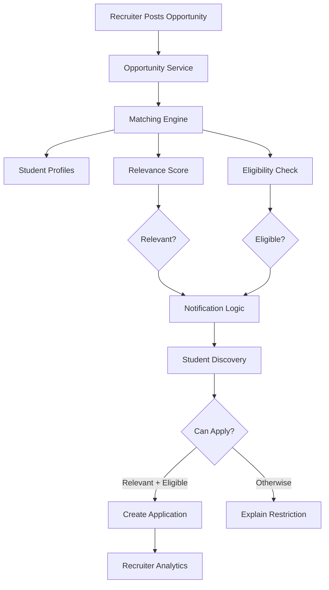

# Smart Opportunity Lifecycle

This document describes the implemented end-to-end feature of PlacementOS: the **complete opportunity lifecycle** connecting Students and Recruiters — from posting an opportunity, through deterministic matching and notifications, to applications and recruiter analytics. It is written for reviewers of the contribution and covers what is implemented, how it works, and how to run it.

- **Stack (implemented):** React 19 + Vite + Tailwind CSS 4 (frontend, JavaScript), Express 5 (backend), in-memory seed data, oxlint, Node's built-in test runner.
- **Status:** scoped contribution — see [Scope & non-goals](#11-scope-non-goals).

---

## 1. Overview

PlacementOS connects two sides:

- **Students** build a profile (skills, preferences, academic data), discover every posted opportunity, see personalized match insights, and apply to the matching opportunities they are eligible for.
- **Recruiters** post opportunities with detailed requirements and eligibility criteria, then monitor reach and track real applications — eventually closing an opportunity to stop new applications.

Both sides are driven by a single **Matching Engine** that scores every student against every opportunity and separates **relevance** from **eligibility**.

```
🏢 Recruiter posts an opportunity
        ↓
🧠 Matching Engine evaluates student profiles
        ↓
📊 Relevance and eligibility are calculated
        ↓
🔔 Qualified students receive notifications
        ↓
🎓 Students browse and discover all opportunities
        ↓
✨ Matching opportunities show personalized match insights
        ↓
📝 Eligible matching students can apply
        ↓
📈 Recruiters can monitor opportunities and analytics
```

---

## 2. Student Profile

The student profile is the starting point for all matching. Each student carries:

- **Academic information** — CGPA, graduation year, branch, active backlogs.
- **Skills** — e.g. `React`, `Node.js`, `MongoDB`, `Git`.
- **Preferences** — preferred roles, preferred domains, preferred locations, and preferred opportunity types (Internship / Full-time).

Students can edit their profile in the UI (`PATCH /api/students/:id`). The request is validated server-side, and updates to skills or preferences feed directly back into the matching engine.

> **Profile updates affect future matching.** Because match scores are computed from the live profile, changing skills or preferences re-ranks the opportunities the student sees and changes the pool of notifications they would receive for newly posted roles.

---

## 3. Opportunity Discovery

Students can:

- **Browse all posted opportunities** (closed opportunities are hidden from the student view).
- **Search** opportunities by role, company, domain, and required skills.
- **Filter** by opportunity type, location, and work mode via contextual / progressive filters.
- See each matching opportunity ranked by its **match score**, with **relevance** and **eligibility** shown as separate indicators.
- Expand **match explanations** ("why this matches you") that show matched vs. missing skills and whether role/domain, location, and opportunity type align.

The default demo experience operates as a fixed mock student (Alex Johnson, `student_005`; configurable via an environment variable).

---

## 4. Matching Engine

The core of the platform is a deterministic, pure scoring function: `matchStudentToOpportunity(student, opportunity)`. It is reused everywhere — the matches API, notifications, application enforcement, and analytics — so the different surfaces can never disagree.

### Match score

A 0–100 score from four weighted dimensions (frozen constants in `matchingService.js`):

```
skills           50  (proportional — higher when more required skills are matched)
role / domain    20  (binary — matches a preferred role or domain)
location         15  (binary — matches a preferred location, or the role is Remote)
opportunity type 15  (binary — Internship / Full-time preference)
TOTAL           100
```

**Skills (50 pts):** skills are normalized (lowercased, trimmed, de-duplicated). Coverage = `matched required skills / total required skills` (no required skills counts as 100%). Score = `percentage × 0.5`. The exact matched and missing skills are returned for display.

**Role/domain, location, type:** each is a binary check with a small fuzzy component — a preference is satisfied if it is contained *in* the opportunity value or contains it. A **Remote** work mode always satisfies location. **Empty preferences are treated as "no restriction"** and count as satisfied.

### Relevance vs eligibility — separate by design

- **Relevance:** `matchScore ≥ 50` (`RELEVANCE_THRESHOLD`). Measures how well the opportunity fits the student's skills and preferences.
- **Eligibility:** four binary checks, each with a human-readable reason: `minimumCgpa`, `allowedBranches`, `graduationYears`, `maximumActiveBacklogs`. All four must pass. Missing criteria on an opportunity are treated as "no restriction" and pass.

**Relevance and eligibility are intentionally independent.** A strong skills match never makes an ineligible student eligible, and eligibility checks never inflate or deflate a match score. A student can be highly relevant but ineligible (wrong branch, below CGPA) — the UI shows both dimensions separately, and applications are only permitted when **both** are true.

### Notification threshold

A separate higher bar controls notifications: a student is notified about an opportunity only when the match is relevant, eligible, **and** `matchScore ≥ 70` (`MIN_MATCH_SCORE_FOR_NOTIFICATION`).

This means candidate quality tiers are:

```
score < 50            not relevant
50 ≤ score < 70       relevant (+ eligible → may apply) but not notified
score ≥ 70            relevant + eligible → recommended, notified
```

---

## 5. Recruiter Workflow

Recruiters access a distinct, role-based experience.

- **Post an opportunity** (`POST /api/opportunities`) with validation of every field.
- Define the opportunity's **type** (Internship / Full-time), **domain**, **work mode**, **locations**, and **description**.
- Define **required skills**.
- Define **eligibility criteria** — minimum CGPA, allowed branches, graduation years, and maximum active backlogs.
- **View posted opportunities** with status (Active / Expired / Closed) and per-opportunity analytics.
- **Close an opportunity** (`PATCH /api/opportunities/:id/close`) to stop new applications while retaining the analytics history.

When an opportunity is created, notification generation runs asynchronously: every student is re-evaluated, and those meeting the relevance + eligibility + threshold rules receive a notification.

---

## 6. Applications

- Students can browse **all** opportunities, but can **apply** only to opportunities where they are a **relevant and eligible** match.
- The backend **enforces** this rule — `applyToOpportunity` re-runs the matching engine and rejects applications that are not relevant (`403 NOT_APPLICABLE`) or where the opportunity is closed (`403 OPPORTUNITY_CLOSED`).
- **Duplicate applications are prevented** (`409 ALREADY_APPLIED`).
- Invalid student/opportunity IDs, and unknown records, return the appropriate client errors.
- Each successful application records the student, the opportunity, a status of `Applied`, and a timestamp.

---

## 7. Notifications

- **Qualified students receive notifications automatically** when a new opportunity strongly matches their profile.
- Notification logic **reuses the existing relevance / eligibility rules**: a notification is created only when the student is relevant, eligible, and above the notification threshold (score ≥ 70).
- **Duplicate prevention:** a student is never notified twice about the same opportunity.
- **Read / unread management:** students can mark a single notification as read or mark all as read; the bell shows an unread count.

---

## 8. Opportunity Analytics

Recruiters see real per-opportunity analytics computed by re-running the matching engine against all students:

- **Students evaluated** — every student scored (`totalStudentsEvaluated`).
- **Relevant matches** — students above the relevance threshold (`relevantStudents`).
- **Eligible students** — students who pass all eligibility checks (`eligibleStudents`).
- **Students notified** — students who received an automated notification (`studentsNotified`).
- **Applications received** — the real number of applications submitted (`applicationsReceived`, backed by the applications store).

---

## 9. Opportunity Lifecycle

The complete flow, end to end:

```
Recruiter Posts
    → Opportunity Created
    → Matching Evaluates Students
    → Qualified Students Notified
    → Students Discover Opportunities
    → Eligible Matches Apply
    → Recruiter Views Analytics
    → Opportunity Can Be Closed
```

The same Matching Engine drives every step, so the notification a student receives, the ranked order they see, and the analytics a recruiter reads are always consistent.

---

## 10. Architecture

### Mermaid diagram



### Component flow

```
Frontend (React · Vite · Tailwind)
          │  fetch() / REST
          ▼
REST API (Express)  routes → controllers → services
          │
          ▼
Matching Engine (matchingService)
          │
          ├──► Student Profiles + Opportunities (in-memory seed data)
          │
          ▼
Eligibility Evaluation  (CGPA · branch · year · backlogs)
          │
          ▼
Match Results  (matchScore · relevant · eligible · explanations)
          │
          ▼
Notification Service (notificationService) — reuses the Matching Engine
          │
          ▼
Application Service (applicationService) — re-enforces relevance + eligibility
          │
          ▼
Analytics Service (analyticsService) — evaluates reach for recruiters
```

**Backend flow:** `routes` define the HTTP surface → `controllers` validate and shape responses → `services` hold domain logic (matching, eligibility, notifications, applications, analytics) over the in-memory data modules.

```
backend/src
├── routes/          HTTP routing (health, students, opportunities, matches, notifications)
├── controllers/     Request handling + response shaping
├── services/        Domain logic (student, opportunity, matching, notification, application, analytics)
├── data/            In-memory seed data (students, opportunities, applications, notifications)
└── server.js        Express app wiring, CORS, JSON body parsing, API 404 + error handling
```

---

## 11. API Overview

Base URL: `http://localhost:5000/api` (configurable — see [Setup](#12-setup)). All routes return JSON. Errors use a consistent envelope:

```json
{ "success": false, "error": { "code": "OPPORTUNITY_NOT_FOUND", "message": "Opportunity not found" } }
```

| Method | Endpoint | Description |
|---|---|---|
| GET | `/health` | Service health check. |
| GET | `/students` | List all student profiles. |
| GET | `/students/:id` | Single student profile. |
| PATCH | `/students/:id` | Update a student profile (validated). |
| GET | `/students/:id/applications` | Applications for a student (with embedded opportunity). |
| GET | `/opportunities` | List all opportunities (with embedded analytics). |
| GET | `/opportunities/:id` | Single opportunity. |
| POST | `/opportunities` | Create an opportunity; schedules notification generation. |
| GET | `/opportunities/:id/analytics` | Per-opportunity analytics for recruiters. |
| GET | `/opportunities/:id/applications` | Applications for an opportunity (with student info + match score). |
| PATCH | `/opportunities/:id/close` | Close an opportunity (stops new applications). |
| POST | `/opportunities/:id/apply` | Apply to an opportunity (backend-enforced; body: `{ studentId }`). |
| GET | `/students/:studentId/opportunities/matches` | Ranked matches for a student (score, relevance, eligibility, explanations + embedded opportunity). |
| GET | `/students/:studentId/opportunities/:opportunityId/match` | Single match for one opportunity. |
| GET | `/students/:studentId/notifications` | Notifications for a student (`count`, `unreadCount`, newest-first, embedded opportunity). |
| PATCH | `/notifications/:notificationId/read` | Mark one notification as read. |
| PATCH | `/students/:studentId/notifications/read-all` | Mark all of a student's notifications as read. |

---

## 12. Setup

Requirements: a recent Node.js LTS with npm (developed/tested on Node 22).

**Backend** (port `5000`):

```bash
cd backend
npm install
npm run dev          # starts http://localhost:5000 via nodemon
```

**Frontend** (port `5173`):

```bash
cd frontend
npm install
npm run dev          # starts http://localhost:5173 via Vite
```

Open `http://localhost:5173`. The page loads ranked matches and the notification bell for the seeded mock student (Alex Johnson, `student_005`). Both servers must run simultaneously; CORS is enabled on the backend.

**Environment variables** (optional — sane defaults exist, see `frontend/.env.example` and `frontend/src/config.js`):

| Variable | Default | Used by | Purpose |
|---|---|---|---|
| `VITE_API_BASE_URL` | `http://localhost:5000/api` | Frontend | Base URL of the backend REST API. |
| `VITE_CURRENT_STUDENT_ID` | `student_005` | Frontend | Which student profile the demo UI operates as. |
| `PORT` | `5000` | Backend | Port the Express server listens on. |

To override frontend variables, copy `frontend/.env.example` to `frontend/.env.local` (git-ignored) and edit.

> **Note:** all data is in-memory. Restarting the backend re-seeds the 5 student profiles and 8 opportunities and clears applications and notifications. This is by design for the scoped contribution (see [Engineering decisions](#14-engineering-decisions)).

---

## 13. Testing

**Backend automated tests** — Node's built-in test runner:

```bash
cd backend
npm test              # runs node --test tests/*.test.js
```

Coverage: matching/eligibility behavior, notification logic, application enforcement (relevance, eligibility, duplicates, closed opportunities), and opportunity close flow. **Verified: 57 tests passing** (`matching.test.js`, `notifications.test.js`, `applications.test.js`, `analytics.test.js`, `opportunityClose.test.js`).

**Frontend static checks and build:**

```bash
cd frontend
npm run lint          # oxlint
npm run build         # production Vite build
```

Both pass cleanly on this contribution.

**Manual end-to-end check:** with both servers running, `POST` a new opportunity that targets the mock student (e.g. a React/JavaScript internship in a preferred location) — it appears ranked near the top of the discovery page, the notification bell shows a new unread notification with the match score, the student can apply to it, and the recruiter dashboard reflects the new application and reach.

---

## 14. Engineering Decisions

1. **Deterministic matching instead of AI/LLMs.** Scores are reproducible, cheap, and explainable — every point can be traced to a specific skill or preference. This provides a transparent baseline that a later AI layer can build on, without hiding decisions behind a model.
2. **Eligibility is separate from relevance.** A strong skills fit can still be a dead end (wrong branch, below CGPA, backlogs). Keeping the two dimensions independent lets the UI show "relevant but not eligible" honestly and prevents eligibility rules from skewing ranking.
3. **The matching service is a pure, reusable function** over plain data. The matches API, notification service, application service, and analytics service all call the same `matchStudentToOpportunity` — one source of truth for scoring means these surfaces can never disagree.
4. **Notifications reuse the matching engine.** Notified opportunities are, by construction, the top relevant + eligible matches — so the notification bell and the ranked page are always consistent.
5. **Applications are backend-enforced.** The application service re-runs the matching engine and rejects non-relevant, ineligible, duplicate, or closed-opportunity applications — the client cannot bypass placement rules.
6. **Mock in-memory data for this scoped contribution.** No database or infrastructure is required to run or review the feature. The service layer is decoupled from persistence, so wiring a real data source later is a straightforward swap. This is **not** production infrastructure.

---

## 15. Scope & Non-goals

The following are **not** implemented here and are intentionally out of scope for this contribution:

- Real authentication / authorization — there is no login; the UI operates as a fixed mock student (`student_005`) and switches between Student / Recruiter experiences locally.
- Persistence — data is in-memory and resets on restart.
- AI/LLM-based matching — matching is deterministic by design.
- Resume builder, AI resume intelligence, placement drive management, and the wider platform modules described in the README roadmap.

The wider PlacementOS roadmap and product vision live in the repository [README](../README.md).
